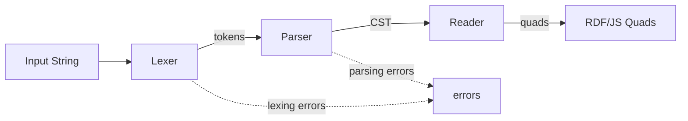

# Mentor RDF Parsers

Standards-compliant, fault-tolerant parsers for RDF languages, built with [Chevrotain](https://chevrotain.io/). Designed for use in IDEs and language tools where error recovery and concrete syntax tree (CST) access are more important than raw parsing speed.

## Supported Languages

| Language | Lexer | Parser | Reader | W3C Specification |
|----------|-------|--------|--------|--------------------|
| **N-Triples** | ✓ | ✓ | ✓ | [RDF 1.2 N-Triples](https://www.w3.org/TR/rdf12-n-triples/) |
| **N-Quads** | ✓ | ✓ | ✓ | [RDF 1.2 N-Quads](https://www.w3.org/TR/rdf12-n-quads/) |
| **Turtle** | ✓ | ✓ | ✓ | [RDF 1.2 Turtle](https://www.w3.org/TR/rdf12-turtle/) |
| **TriG** | ✓ | ✓ | — | [RDF 1.2 TriG](https://www.w3.org/TR/rdf12-trig/) |
| **N3 (Notation3)** | ✓ | ✓ | ✓ | [W3C N3](https://w3c.github.io/N3/spec/) |
| **SPARQL 1.2** | ✓ | ✓ | — | [SPARQL 1.2 Query](https://www.w3.org/TR/sparql12-query/) |

## Features

### Standards Compliance

Every parser implements the grammar productions from the corresponding W3C specification. The parsers are validated against the official W3C test suites:

- **Turtle** — W3C RDF Test Suite for Turtle
- **TriG** — W3C RDF Test Suite for TriG
- **N-Triples** — W3C RDF Test Suite for N-Triples
- **N-Quads** — W3C RDF Test Suite for N-Quads
- **SPARQL 1.2** — W3C SPARQL 1.2 Test Suite (syntax tests)

### Fault Tolerance

All parsers run with Chevrotain's `recoveryEnabled: true`, which means they can recover from syntax errors and continue parsing the rest of the document. This is essential for IDE use cases where users are actively editing and the document is frequently in an invalid state.

### Concrete Syntax Trees

The parsers produce Chevrotain CST nodes, giving you full access to every token including its position, image, and type. This makes the parsers suitable for:

- Syntax highlighting (comment tokens are preserved)
- Code navigation and symbol extraction
- Refactoring and formatting tools
- Diagnostics and error reporting with precise source locations

### RDF/JS Quad Readers

Reader classes traverse the CST and produce [RDF/JS](https://rdf.js.org/data-model-spec/)-compliant Quad objects (via `@rdfjs/data-model`). Available for N-Triples, N-Quads, Turtle, and N3.

## Installation

```bash
npm install @faubulous/mentor-rdf-parsers
```

## Architecture



- **Lexer** — Tokenizes the input string into a token stream.
- **Parser** — Produces a concrete syntax tree (CST) from the tokens using Chevrotain's grammar rules.
- **Reader** — Walks the CST and produces RDF/JS Quad objects.

## Usage

Each parser follows the same three-step pattern: **tokenize → parse → (optionally) read**.

### Parsing Turtle

```typescript
import { Turtle, TurtleReader } from '@faubulous/mentor-rdf-parsers';

const input = `
  @prefix ex: <http://example.org/> .
  ex:Alice ex:knows ex:Bob .
`;

// 1. Tokenize
const lexer = new Turtle.TurtleLexer();
const lexResult = lexer.tokenize(input);

// 2. Parse into a CST
const parser = new Turtle.TurtleParser();
const cst = parser.parse('http://example.org/', lexResult.tokens);

// 3. Read RDF/JS quads from the CST
const reader = new TurtleReader.TurtleReader();
const quads = reader.visit(cst);
```

### Parsing N-Triples

```typescript
import { NTriples, NTriplesReader } from '@faubulous/mentor-rdf-parsers';

const input = '<http://example.org/Alice> <http://example.org/knows> <http://example.org/Bob> .\n';

const lexResult = new NTriples.NTriplesLexer().tokenize(input);
const cst = new NTriples.NTriplesParser().parse(lexResult.tokens);
const quads = new NTriplesReader.NTriplesReader().visit(cst);
```

### Parsing N-Quads

```typescript
import { NQuads, NQuadsReader } from '@faubulous/mentor-rdf-parsers';

const input = '<http://example.org/Alice> <http://example.org/knows> <http://example.org/Bob> <http://example.org/graph1> .\n';

const lexResult = new NQuads.NQuadsLexer().tokenize(input);
const cst = new NQuads.NQuadsParser().parse(lexResult.tokens);
const quads = new NQuadsReader.NQuadsReader().visit(cst);
```

### Parsing SPARQL 1.2

```typescript
import { Sparql } from '@faubulous/mentor-rdf-parsers';

const input = 'SELECT ?name WHERE { ?person <http://example.org/name> ?name }';

// Pre-process codepoint escapes (per SPARQL spec section 19.2)
const processed = Sparql.resolveCodepointEscapes(input);

const lexResult = new Sparql.SparqlLexer().tokenize(processed);
const cst = new Sparql.SparqlParser().parse(lexResult.tokens);
```

### Parsing N3 (Notation3)

```typescript
import { N3, N3Reader } from '@faubulous/mentor-rdf-parsers';

const input = `
  @prefix ex: <http://example.org/> .
  { ex:Alice ex:knows ex:Bob } => { ex:Bob ex:knows ex:Alice } .
`;

const lexResult = new N3.N3Lexer().tokenize(input);
const cst = new N3.N3Parser().parse('http://example.org/', lexResult.tokens);
const quads = new N3Reader.N3Reader().visit(cst);
```

### Parsing TriG

```typescript
import { Trig } from '@faubulous/mentor-rdf-parsers';

const input = `
  @prefix ex: <http://example.org/> .
  ex:graph1 {
    ex:Alice ex:knows ex:Bob .
  }
`;

const lexer = new Trig.TrigLexer();
const lexResult = lexer.tokenize(input);

const parser = new Trig.TrigParser();
parser.input = lexResult.tokens;
const cst = parser.trigDoc();
```

## Error Handling

The parsers are fault-tolerant and collect errors rather than throwing immediately. This allows you to parse invalid documents and still get a partial CST.

### Accessing Lexer Errors

Lexer errors occur when the input contains invalid tokens (e.g., malformed IRIs, illegal characters):

```typescript
import { Turtle } from '@faubulous/mentor-rdf-parsers';

const input = '<invalid iri> <http://example.org/p> "value" .';

const lexer = new Turtle.TurtleLexer();
const lexResult = lexer.tokenize(input);

// Check for lexing errors
if (lexResult.errors.length > 0) {
    for (const error of lexResult.errors) {
        console.log(`Lexer error at offset ${error.offset}: ${error.message}`);
    }
}
```

### Accessing Parser Errors

Parser errors occur when the token sequence doesn't match the grammar (e.g., missing period, invalid structure):

```typescript
import { Turtle } from '@faubulous/mentor-rdf-parsers';

const input = `
  @prefix ex: <http://example.org/> .
  ex:Alice ex:knows ex:Bob
  ex:Charlie ex:knows ex:Dave .
`;

const lexer = new Turtle.TurtleLexer();
const lexResult = lexer.tokenize(input);

const parser = new Turtle.TurtleParser();
parser.input = lexResult.tokens;

// Parse without throwing - use the rule method directly
const cst = parser.turtleDoc();

// Check for parsing errors
if (parser.errors.length > 0) {
    for (const error of parser.errors) {
        console.log(`Parser error: ${error.message}`);
        
        // Access token position information
        if (error.token) {
            console.log(`  at line ${error.token.startLine}, column ${error.token.startColumn}`);
        }
    }
}

// CST is still available (partial result)
console.log('CST:', cst);
```

### Error Types

Both lexer and parser errors include useful diagnostic information:

```typescript
interface ILexingError {
    offset: number;      // Character offset in input
    line: number;        // Line number (1-based)
    column: number;      // Column number (1-based)
    length: number;      // Length of problematic text
    message: string;     // Human-readable error message
}

interface IRecognitionException {
    name: string;        // Error type (e.g., 'MismatchedTokenException')
    message: string;     // Human-readable error message
    token: IToken;       // The token where error occurred
    resyncedTokens: IToken[];  // Tokens skipped during recovery
    context: {
        ruleStack: string[];      // Grammar rules being parsed
        ruleOccurrenceStack: number[];
    };
}
```

### Strict Mode (Throw on Errors)

If you prefer to throw on parsing errors (default behavior of `parse()` method):

```typescript
import { Turtle, TurtleReader } from '@faubulous/mentor-rdf-parsers';

const input = `@prefix ex: <http://example.org/> .
ex:Alice ex:knows ex:Bob .`;

const lexer = new Turtle.TurtleLexer();
const lexResult = lexer.tokenize(input);

// Check lexer errors first
if (lexResult.errors.length > 0) {
    throw new Error(`Lexing failed: ${lexResult.errors[0].message}`);
}

try {
    // parse() throws if there are parsing errors
    const parser = new Turtle.TurtleParser();
    const cst = parser.parse('http://example.org/', lexResult.tokens);
    
    const reader = new TurtleReader.TurtleReader();
    const quads = reader.visit(cst);
} catch (error) {
    console.error('Parsing failed:', error.message);
}
```

## Testing

```bash
npm test
```

The test suite includes over 1,200 tests covering all supported languages, including the official W3C conformance test suites.

## License

[LGPL-2.1-or-later](LICENSE)
