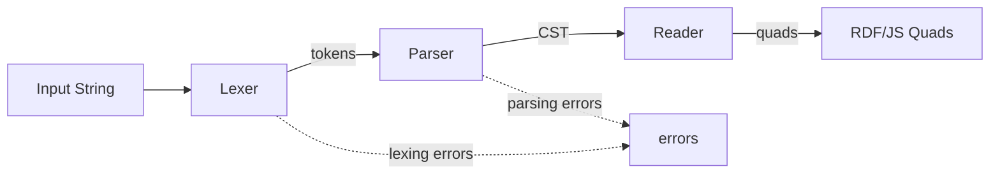

# Mentor RDF Parsers

[](https://opensource.org/licenses/LGPL-2.1)
[](https://faubulous.github.io/mentor-vscode/)
[](https://www.npmjs.com/package/@faubulous/mentor-rdf-parsers)
[](https://www.typescriptlang.org/)
[](https://www.w3.org/TR/rdf12-concepts/)

Standards-compliant, fault-tolerant parsers for RDF languages, built with [Chevrotain](https://chevrotain.io/). Designed for IDEs and language tools where error recovery and concrete syntax tree (CST) access are essential.

## Features

- **Standards Compliance** — Implements grammar productions from W3C specifications
- **Fault Tolerance** — Recovers from syntax errors and continues parsing
- **Concrete Syntax Trees** — Full token access with positions for tooling
- **RDF/JS Quads** — Reader classes produce [RDF/JS](https://rdf.js.org/data-model-spec/)-compliant quads
- **Blank Node Tracking** — Pre-assigned IDs for IDE features like "go to definition"

## Supported Languages

| Language | Parser | Reader | Specification |
|----------|:------:|:------:|---------------|
| N-Triples | ✓ | ✓ | [RDF 1.2 N-Triples](https://www.w3.org/TR/rdf12-n-triples/) |
| N-Quads | ✓ | ✓ | [RDF 1.2 N-Quads](https://www.w3.org/TR/rdf12-n-quads/) |
| Turtle | ✓ | ✓ | [RDF 1.2 Turtle](https://www.w3.org/TR/rdf12-turtle/) |
| TriG | ✓ | ✓ | [RDF 1.2 TriG](https://www.w3.org/TR/rdf12-trig/) |
| N3 | ✓ | ✓ | [W3C N3](https://w3c.github.io/N3/spec/) |
| SPARQL 1.2 | ✓ | — | [SPARQL 1.2 Query](https://www.w3.org/TR/sparql12-query/) |

## Installation

```bash
npm install @faubulous/mentor-rdf-parsers
```

## Quick Start

```typescript
import { TurtleLexer, TurtleParser, TurtleReader } from '@faubulous/mentor-rdf-parsers';

const input = `
  @prefix ex: <http://example.org/> .
  ex:Alice ex:knows ex:Bob .
`;

// Tokenize → Parse → Read
const lexResult = new TurtleLexer().tokenize(input);
const cst = new TurtleParser().parse(lexResult.tokens);
const quads = new TurtleReader().visit(cst);

console.log(quads[0].subject.value); // "http://example.org/Alice"
```

## Architecture


```mermaid
flowchart LR
    A[Input String] --> B[Lexer]
    B -->|tokens| C[Parser]
    C -->|CST| D[Reader]
    D -->|quads| E[RDF/JS Quads]
    
    B -.->|lexing errors| F[errors]
    C -.->|parsing errors| F
```

| Component | Purpose |
|-----------|---------|
| **Lexer** | Tokenizes input string into a token stream |
| **Parser** | Produces a concrete syntax tree (CST) from tokens |
| **Reader** | Walks the CST and produces RDF/JS Quad objects |

## Documentation

📚 **[Full Documentation](docs/README.md)**

### Examples by Language

| Language | Guide |
|----------|-------|
| Turtle | [docs/examples/turtle.md](docs/examples/turtle.md) |
| N-Triples | [docs/examples/n-triples.md](docs/examples/n-triples.md) |
| N-Quads | [docs/examples/n-quads.md](docs/examples/n-quads.md) |
| TriG | [docs/examples/trig.md](docs/examples/trig.md) |
| N3 | [docs/examples/n3.md](docs/examples/n3.md) |
| SPARQL | [docs/examples/sparql.md](docs/examples/sparql.md) |

### Advanced Topics

- [Error Handling](docs/error-handling.md) — Fault-tolerant parsing and error collection
- [Blank Node IDs](docs/blank-node-ids.md) — Pre-assigned identifiers for IDE integration

## Error Handling

Parsers collect errors instead of throwing, allowing partial results:

```typescript
const parser = new TurtleParser();
const cst = parser.parse(tokens, false); // Pass false to collect errors

// Check all error sources
console.log(lexResult.errors);       // Lexer errors
console.log(parser.errors);          // Parser errors
console.log(parser.semanticErrors);  // Semantic errors (e.g., undefined prefixes)
```

See [Error Handling Guide](docs/error-handling.md) for details.

## Token Access

Each language exports its token array for use in formatters and syntax highlighters:

```typescript
import { TurtleTokens, SparqlTokens } from '@faubulous/mentor-rdf-parsers';

console.log(TurtleTokens.map(t => t.name));
```

## Testing

```bash
npm test
```

The test suite includes over 1,500 tests covering all supported languages and the official W3C conformance test suites.

## License

[LGPL-2.1-or-later](LICENSE)
