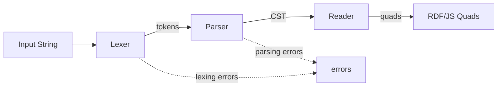

# Mentor RDF Parsers

Standards-compliant, fault-tolerant parsers for RDF languages, built with [Chevrotain](https://chevrotain.io/). Designed for use in IDEs and language tools where error recovery and concrete syntax tree (CST) access are more important than raw parsing speed.

## Supported Languages

| Language | Lexer | Parser | Reader | W3C Specification |
|----------|-------|--------|--------|--------------------|
| **N-Triples** | ✓ | ✓ | ✓ | [RDF 1.2 N-Triples](https://www.w3.org/TR/rdf12-n-triples/) |
| **N-Quads** | ✓ | ✓ | ✓ | [RDF 1.2 N-Quads](https://www.w3.org/TR/rdf12-n-quads/) |
| **Turtle** | ✓ | ✓ | ✓ | [RDF 1.2 Turtle](https://www.w3.org/TR/rdf12-turtle/) |
| **TriG** | ✓ | ✓ | ✓ | [RDF 1.2 TriG](https://www.w3.org/TR/rdf12-trig/) |
| **N3 (Notation3)** | ✓ | ✓ | ✓ | [W3C N3](https://w3c.github.io/N3/spec/) |
| **SPARQL 1.2** | ✓ | ✓ | — | [SPARQL 1.2 Query](https://www.w3.org/TR/sparql12-query/) |

## Features

### Standards Compliance

Every parser implements the grammar productions from the corresponding W3C specification. The parsers are validated against the official W3C test suites:

- **Turtle** — W3C RDF Test Suite for Turtle
- **TriG** — W3C RDF Test Suite for TriG
- **N-Triples** — W3C RDF Test Suite for N-Triples
- **N-Quads** — W3C RDF Test Suite for N-Quads
- **SPARQL 1.2** — W3C SPARQL 1.2 Test Suite (syntax tests)

### Fault Tolerance

All parsers run with Chevrotain's `recoveryEnabled: true`, which means they can recover from syntax errors and continue parsing the rest of the document. This is essential for IDE use cases where users are actively editing and the document is frequently in an invalid state.

### Concrete Syntax Trees

The parsers produce Chevrotain CST nodes, giving you full access to every token including its position, image, and type. This makes the parsers suitable for:

- Syntax highlighting (comment tokens are preserved)
- Code navigation and symbol extraction
- Refactoring and formatting tools
- Diagnostics and error reporting with precise source locations

### RDF/JS Quad Readers

Reader classes traverse the CST and produce [RDF/JS](https://rdf.js.org/data-model-spec/)-compliant Quad objects (via `@rdfjs/data-model`). Available for N-Triples, N-Quads, Turtle, and N3.

### Blank Node ID Pre-assignment

All lexers automatically assign stable identifiers to tokens that produce blank nodes during parsing. This enables mapping blank node identifiers back to their source positions in the document — essential for IDE features like "go to definition" and symbol tracking, even for documents that don't produce triples (like SPARQL queries).

Blank node IDs are assigned to:
- `LBRACKET` (`[`) — anonymous blank nodes
- `LPARENT` (`(`) — collection heads
- `OPEN_REIFIED_TRIPLE` (`<<`) — anonymous reifiers
- `OPEN_ANNOTATION` (`{|`) — annotation blank nodes
- `LCURLY` (`{`) — N3 formulas
- `TILDE` (`~`) — N3 quick variables

## Installation

```bash
npm install @faubulous/mentor-rdf-parsers
```

## Architecture


```mermaid
flowchart LR
    A[Input String] --> B[Lexer]
    B -->|tokens| C[Parser]
    C -->|CST| D[Reader]
    D -->|quads| E[RDF/JS Quads]
    
    B -.->|lexing errors| F[errors]
    C -.->|parsing errors| F
```

- **Lexer** — Tokenizes the input string into a token stream.
- **Parser** — Produces a concrete syntax tree (CST) from the tokens using Chevrotain's grammar rules.
- **Reader** — Walks the CST and produces RDF/JS Quad objects.

## Usage

Each parser follows the same three-step pattern: **tokenize → parse → (optionally) read**.

### Parsing Turtle

```typescript
import { TurtleLexer, TurtleParser, TurtleReader } from '@faubulous/mentor-rdf-parsers';

const input = `
  @prefix ex: <http://example.org/> .
  ex:Alice ex:knows ex:Bob .
`;

// 1. Tokenize
const lexer = new TurtleLexer();
const lexResult = lexer.tokenize(input);

// 2. Parse into a CST
const parser = new TurtleParser();
const cst = parser.parse(lexResult.tokens);

// 3. Read RDF/JS quads from the CST
const reader = new TurtleReader();
const quads = reader.visit(cst);
```

### Parsing N-Triples

```typescript
import { NTriplesLexer, NTriplesParser, NTriplesReader } from '@faubulous/mentor-rdf-parsers';

const input = '<http://example.org/Alice> <http://example.org/knows> <http://example.org/Bob> .\n';

const lexResult = new NTriplesLexer().tokenize(input);
const cst = new NTriplesParser().parse(lexResult.tokens);
const quads = new NTriplesReader().visit(cst);
```

### Parsing N-Quads

```typescript
import { NQuadsLexer, NQuadsParser, NQuadsReader } from '@faubulous/mentor-rdf-parsers';

const input = '<http://example.org/Alice> <http://example.org/knows> <http://example.org/Bob> <http://example.org/graph1> .\n';

const lexResult = new NQuadsLexer().tokenize(input);
const cst = new NQuadsParser().parse(lexResult.tokens);
const quads = new NQuadsReader().visit(cst);
```

### Parsing SPARQL 1.2

```typescript
import { SparqlLexer, SparqlParser } from '@faubulous/mentor-rdf-parsers';

const input = 'SELECT ?name WHERE { ?person <http://example.org/name> ?name }';

// Note: Codepoint escapes (\uXXXX, \UXXXXXXXX) are resolved automatically by SparqlLexer
const lexResult = new SparqlLexer().tokenize(input);
const cst = new SparqlParser().parse(lexResult.tokens);
```

### Parsing N3 (Notation3)

```typescript
import { N3Lexer, N3Parser, N3Reader } from '@faubulous/mentor-rdf-parsers';

const input = `
  @prefix ex: <http://example.org/> .
  { ex:Alice ex:knows ex:Bob } => { ex:Bob ex:knows ex:Alice } .
`;

const lexResult = new N3Lexer().tokenize(input);
const cst = new N3Parser().parse(lexResult.tokens);
const quads = new N3Reader().visit(cst);
```

### Parsing TriG

```typescript
import { TrigLexer, TrigParser, TrigReader } from '@faubulous/mentor-rdf-parsers';

const input = `
  @prefix ex: <http://example.org/> .
  ex:graph1 {
    ex:Alice ex:knows ex:Bob .
  }
`;

const lexResult = new TrigLexer().tokenize(input);
const cst = new TrigParser().parse(lexResult.tokens);
const quads = new TrigReader().visit(cst);
```

### Blank Node ID Pre-assignment

Lexers automatically assign stable IDs to blank node-producing tokens, stored in `token.payload.blankNodeId`. These IDs are used by readers when creating blank nodes in the resulting quads.

```typescript
import { TurtleLexer, TurtleParser, TurtleReader, getBlankNodeIdFromToken } from '@faubulous/mentor-rdf-parsers';

const input = `
  @prefix ex: <http://example.org/> .
  [ ex:name "Alice" ] ex:knows [ ex:name "Bob" ] .
`;

// Lexer assigns IDs to LBRACKET tokens
const lexer = new TurtleLexer();
const lexResult = lexer.tokenize(input);

// Find blank node tokens and their pre-assigned IDs
const blankNodeTokens = lexResult.tokens.filter(t => t.tokenType.name === 'LBRACKET');
for (const token of blankNodeTokens) {
    console.log(`Token at offset ${token.startOffset}: ${getBlankNodeIdFromToken(token)}`);
    // Output: "Token at offset 37: _:b0"
    //         "Token at offset 62: _:b1"
}

// Reader uses these pre-assigned IDs
const cst = new TurtleParser().parse(lexResult.tokens);
const quads = new TurtleReader().visit(cst);

// Blank nodes in quads match the token IDs
const firstBlankNode = quads[0].subject;
console.log(firstBlankNode.value); // "b0"
```

#### Custom ID Generator

You can provide a custom ID generator function to the lexer:

```typescript
import { TurtleLexer } from '@faubulous/mentor-rdf-parsers';

// Custom format: "node-0", "node-1", etc.
const lexer = new TurtleLexer((counter) => `node-${counter}`);
const lexResult = lexer.tokenize('[] a <http://example.org/Thing> .');

// First blank node token gets ID "node-0"
```

#### Disabling ID Assignment

Pass `null` to disable automatic ID assignment:

```typescript
const lexer = new TurtleLexer(null);
// Tokens will not have blankNodeId in their payload
```

## Error Handling

The parsers are fault-tolerant and collect errors rather than throwing immediately. This allows you to parse invalid documents and still get a partial CST.

There are three types of errors:

- **Lexer errors** — Invalid tokens (malformed IRIs, illegal characters)
- **Parser errors** — Token sequences that don't match the grammar (missing period, invalid structure)
- **Semantic errors** — Valid syntax but invalid semantics (undefined namespace prefixes)

### Accessing Lexer Errors

Lexer errors occur when the input contains invalid tokens (e.g., malformed IRIs, illegal characters):

```typescript
import { TurtleLexer } from '@faubulous/mentor-rdf-parsers';

const input = '<invalid iri> <http://example.org/p> "value" .';

const lexer = new TurtleLexer();
const lexResult = lexer.tokenize(input);

// Check for lexing errors
if (lexResult.errors.length > 0) {
    for (const error of lexResult.errors) {
        console.log(`Lexer error at offset ${error.offset}: ${error.message}`);
    }
}
```

### Accessing Parser Errors

Parser errors occur when the token sequence doesn't match the grammar (e.g., missing period, invalid structure):

```typescript
import { TurtleLexer, TurtleParser } from '@faubulous/mentor-rdf-parsers';

const input = `
  @prefix ex: <http://example.org/> .
  ex:Alice ex:knows ex:Bob
  ex:Charlie ex:knows ex:Dave .
`;

const lexer = new TurtleLexer();
const lexResult = lexer.tokenize(input);

const parser = new TurtleParser();

// Parse with throwOnErrors=false to collect errors instead of throwing
const cst = parser.parse(lexResult.tokens, false);

// Check for parsing errors
if (parser.errors.length > 0) {
    for (const error of parser.errors) {
        console.log(`Parser error: ${error.message}`);
        
        // Access token position information
        if (error.token) {
            console.log(`  at line ${error.token.startLine}, column ${error.token.startColumn}`);
        }
    }
}

// CST is still available (partial result)
console.log('CST:', cst);
```

### Error Types

Both lexer and parser errors include useful diagnostic information:

```typescript
interface ILexingError {
    offset: number;      // Character offset in input
    line: number;        // Line number (1-based)
    column: number;      // Column number (1-based)
    length: number;      // Length of problematic text
    message: string;     // Human-readable error message
}

interface IRecognitionException {
    name: string;        // Error type (e.g., 'MismatchedTokenException')
    message: string;     // Human-readable error message
    token: IToken;       // The token where error occurred
    resyncedTokens: IToken[];  // Tokens skipped during recovery
    context: {
        ruleStack: string[];      // Grammar rules being parsed
        ruleOccurrenceStack: number[];
    };
}

// Semantic errors (e.g., UndefinedNamespacePrefixError)
interface SemanticError {
    name: string;        // Error type (e.g., 'UndefinedNamespacePrefixError')
    message: string;     // Human-readable error message
    token: IToken;       // The token where error occurred
    ruleStack: number[]; // Grammar rules being parsed when error occurred
}
```

### Collecting Semantic Errors

Semantic errors like undefined namespace prefixes can be collected instead of thrown by passing `throwOnErrors=false` to the `parse()` method:

```typescript
import { TurtleLexer, TurtleParser } from '@faubulous/mentor-rdf-parsers';

const input = `foo:subject bar:predicate baz:object .`; // No prefixes defined!

const lexer = new TurtleLexer();
const lexResult = lexer.tokenize(input);

const parser = new TurtleParser();

// Pass false to collect errors instead of throwing
const cst = parser.parse(lexResult.tokens, false);

// Check for semantic errors (like undefined prefixes)
if (parser.semanticErrors.length > 0) {
    for (const error of parser.semanticErrors) {
        console.log(`${error.name}: ${error.message}`);
        console.log(`  at line ${error.token.startLine}, column ${error.token.startColumn}`);
    }
}

// CST is still available (partial result)
console.log('CST:', cst);
```

### Strict Mode (Throw on Errors)

By default, the `parse()` method throws on parsing errors. Use `throwOnErrors=false` to collect errors instead:

```typescript
import { TurtleLexer, TurtleParser, TurtleReader } from '@faubulous/mentor-rdf-parsers';

const input = `@prefix ex: <http://example.org/> .
ex:Alice ex:knows ex:Bob .`;

const lexer = new TurtleLexer();
const lexResult = lexer.tokenize(input);

// Check lexer errors first
if (lexResult.errors.length > 0) {
    throw new Error(`Lexing failed: ${lexResult.errors[0].message}`);
}

try {
    // parse() throws if there are parsing or semantic errors
    const parser = new TurtleParser();
    const cst = parser.parse(lexResult.tokens);
    
    const reader = new TurtleReader();
    const quads = reader.visit(cst);
} catch (error) {
    console.error('Parsing failed:', error.message);
}
```

## Testing

```bash
npm test
```

The test suite includes over 1,500 tests covering all supported languages, including the official W3C conformance test suites.

## License

[LGPL-2.1-or-later](LICENSE)
